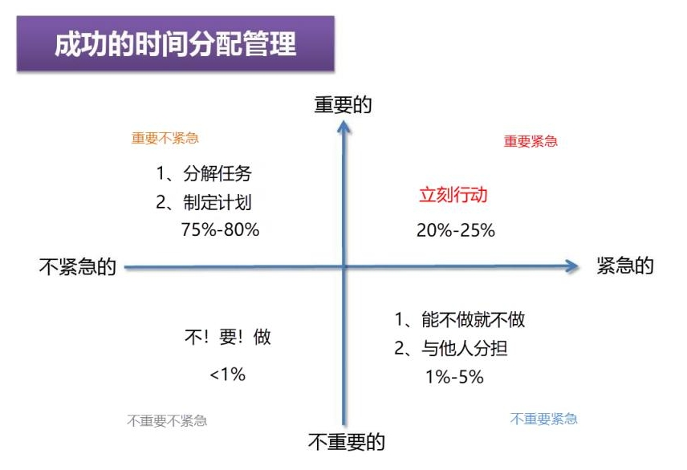

# 四象限项目任务管理方法
   任务“四象限”是美国的管理学家科维提出的一个时间管理的理论，把工作按照重要和紧急两个不同的程度进行了划分，基本上可以分为四个“象限”
   
处理顺序划分：先是既紧急又重要的，接着是重要但不紧急的，再到紧急但不重要的，最后才是既不紧急也不重要的。“四象限”法的关键在于第二和第三类的顺序问题，必须非常小心区分。另外，也要注意划分好第一和第三类事，都是紧急的，分别就在于前者能带来价值，实现某种重要目标，而后者不能。

## 重要紧急
- 内容：这个任务非常重要，而且要求完成时间已经非常紧迫了（如客户投诉、即将到期的任务、财务危机等）
- 思考：针对有那么多重要而紧急的事情需要处理吗？
- 处理方法：立即去做
- 饱和后果：压力无限大，产生危机
- 原则：越少越好，很多第一象限的任务就是因为他们在第二象限时没有处理好
- 好处：基本没有好处，疲于奔命

## 重要不紧急

- 内容：制定工作计划，提升工作效率，建立良好的人际关系（如包括长期的规划、人员培训、制订防范措施、问题的发掘与预防等）
- 思考：管理不好这个象限将使第一象限工作内容扩大，使我们陷入更大的压力，在危机中疲于应付。反之，多投入一些时间在这个领域有利于提高实践能力，缩小第一象限的范围。做好事先的规划、准备与预防措施，很多急事将无从产生。这个领域的事情不会对我们造成催促力量，所以必须主动去做，这是发挥个人领导力的领域
- 处理方法：有计划的做这个象限内的事情
- 饱和后果：忙碌但不盲目
- 原则：集中精力处理，分级任务，明确目标，做好计划
- 好处：做好第二象限的工作，可以最大程度的避免工作进入第一象限

## 紧急不重要
- 内容：不速之客的到访，临时安排的工作（如电话铃声、不速之客、部门会议等）

- 思考：如何能够经理的减少第三象限的事情

- 处理方法：交给别人去做

- 饱和后果：忙碌而且盲目，我们花很多时间在这个里面打转，自以为是在第一象限，其实不过是在满足别人的期望与标准。

- 原则：放权交给别人去做

- 好处：没有好处，但是我们忙碌又盲目的源头
### 不重要不紧急
- 内容：上网，聊天，购物 （如阅读令人上瘾的无聊小说、毫无内容的电视节目、办公室聊天等）

- 思考：如果的在工作中，有必要做这些事情吗？

- 处理方法：尽量别做，但我们往往在一、三象限来回奔走，忙得焦头烂额，不得不到第四象限去疗养一番再出发

- 饱和后果：浪费生命

- 原则：偶尔调节身心，但是一定不能沉溺于此

- 好处：除了放松，没有其他好处

---
参考文档 [四象限项目任务管理方法](http://www.weipm.net/news/sxxrw.html)